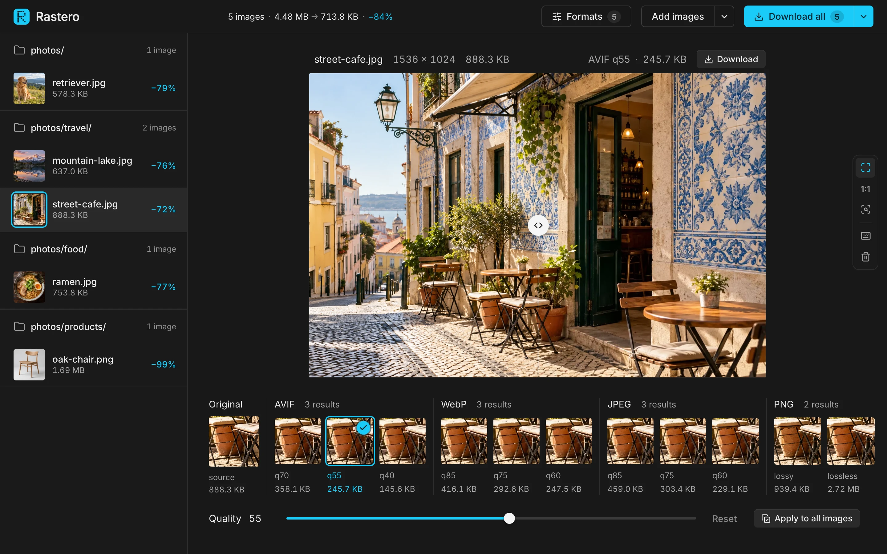
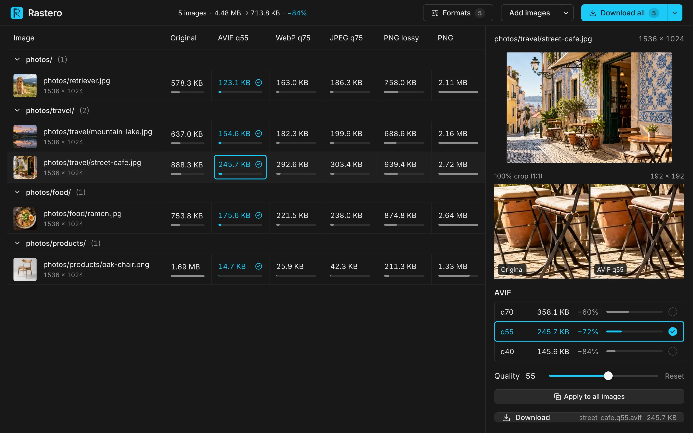
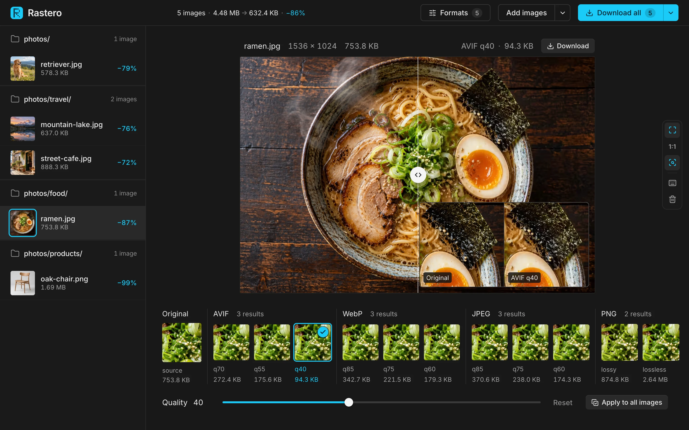
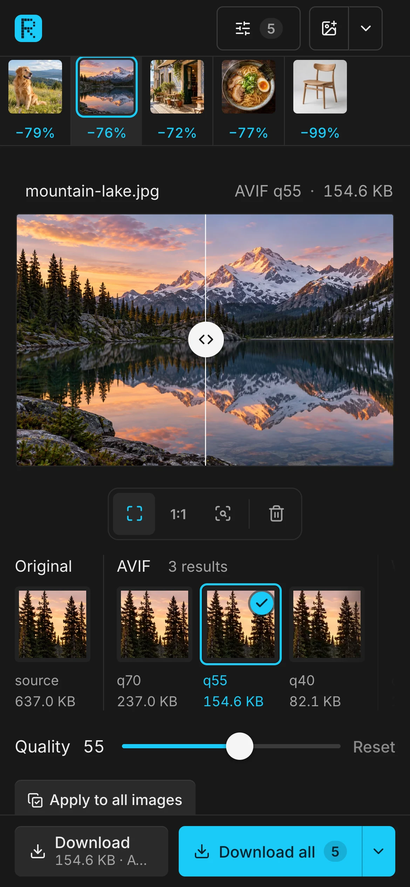
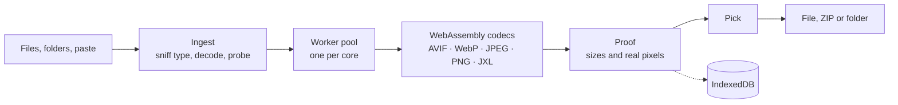

<p align="center">
  
</p>

<h1 align="center">Rastero</h1>

<p align="center">
  <strong>Every image format and quality, measured side by side.</strong><br />
  Compress images in your browser. Nothing is uploaded.
</p>

<p align="center">
  <a href="https://koray.dev/rastero/"><strong>Open Rastero →</strong></a>
</p>



Which format, at which quality? Usually you guess, export, squint, and try again. Rastero encodes every image you give it as AVIF, WebP, JPEG and PNG at several qualities, measures every result, and shows the real encoded pixels next to the numbers. Pick one per image (or keep Rastero's pick), then download a single file, a ZIP that keeps your folder structure, or save straight into a folder.

Everything runs locally in WebAssembly. Your images never leave the device, and after the first visit Rastero works offline.

## Features

- **Every format, measured.** Each image is encoded in all enabled formats at three quality tiers (high, balanced, small). JPEG XL is available and off by default; choose formats from **Formats** in the top bar.
- **Judge by pixels, not numbers.** A before/after split view, 1:1 actual-pixel zoom, a loupe, and a 1:1 detail crop for every result, taken from the busiest part of the image, where compression artifacts show first. The original's crop leads the strip as the reference.
- **A sensible pick.** The smallest balanced result that keeps the image's transparency is picked for you; when nothing beats the source file, the original is kept. Click any result, or the original, to override.
- **Fine-tune, then batch.** A quality slider re-encodes the picked format at any quality, and **Reset** returns to the tier default. **Apply to all images** uses the same format and quality for the whole batch.
- **Folders in, folders out.** Choose, drop or paste images and whole folders, subfolders included. **Download all** gives a ZIP that mirrors the tree, or saves into a folder directly in Chrome and Edge. The menu next to it switches between the picked result per image and one format for every image.
- **Batch view.** Press <kbd>G</kbd> for a table of every image and format with sizes drawn to scale; <kbd>E</kbd> returns to the proof.
- **Survives a reload.** Images, finished results, picks and tuned qualities are kept in the browser's own storage (IndexedDB). A refresh or a closed tab brings the session back without re-encoding, and unfinished work resumes. **Clear all images** in the Add menu removes them from storage too.
- **Offline and installable.** The app shell is cached on the first visit and each codec the first time it runs. Rastero can be installed as an app from the browser.
- **Works on phones.** Touch-sized controls, a bottom action bar for downloads, and a split view that follows sideways drags while vertical swipes scroll the page.

| Batch view | Loupe at the smallest AVIF | Phone |
|---|---|---|
|  |  |  |

## Formats

| | |
|---|---|
| **Reads** | JPEG, PNG, WebP, AVIF, GIF (first frame), BMP, HEIC/HEIF, JPEG XL |
| **Writes** | AVIF (libavif), WebP (libwebp), JPEG (MozJPEG), PNG lossy (libimagequant + OxiPNG), PNG lossless (OxiPNG), JPEG XL (libjxl) |

HEIC is decoded natively on Safari and with libheif (WebAssembly, loaded only when a HEIC file arrives) elsewhere. JPEG XL results that the browser can't display yet are decoded back to PNG for the preview, so you still see their real artifacts. Metadata such as EXIF and GPS is not carried into the outputs.

## Keyboard

| Key | Action |
|---|---|
| <kbd>↑</kbd> <kbd>↓</kbd> | Previous / next image |
| <kbd>←</kbd> <kbd>→</kbd> | Previous / next result |
| <kbd>Space</kbd> (hold) | Show the original |
| <kbd>Z</kbd> | Fit / 1:1 |
| <kbd>L</kbd> | Loupe |
| <kbd>D</kbd> | Download the picked result |
| <kbd>G</kbd> / <kbd>E</kbd> | Batch view / proof view |
| <kbd>?</kbd> | All shortcuts |

## Privacy

There is no server-side code. Files are read and encoded in your browser. The page's Content Security Policy allows connections only back to its own origin, so the app can't send your images anywhere even by mistake. Session data stays in this browser's storage until you clear it.

## How it works



Browsers can't do this on their own: canvas `toBlob` silently falls back to PNG when asked for AVIF or JPEG XL, and each browser's built-in encoders produce different bytes for the same settings. Rastero uses the [jSquash](https://github.com/jamsinclair/jSquash) builds of the Squoosh codecs instead, so every browser runs the same encoders.

Encoding is heavy. On one Apple Silicon core, a 12 MP photo takes about 0.7 s for JPEG or WebP, about 4 s for AVIF and about 8 s for JPEG XL, so the work runs in a pool of Web Workers sized to the machine's cores. Each worker runs single-threaded WebAssembly, which means no cross-origin isolation headers are needed and the app works on any static host. The selected image's jobs jump the queue, and each codec is downloaded only when first used.

## Develop

Requires [Bun](https://bun.sh).

```sh
bun install
bun run dev      # http://localhost:5173
bun test         # unit tests
bun run lint     # oxlint
bun run build    # type-check and build into dist/
```

## Deploy

Rastero is a static site. The build uses relative URLs, so `dist/` works at a domain root or under any path.

This repository deploys to GitHub Pages with [`.github/workflows/deploy.yml`](.github/workflows/deploy.yml): every push to `main` runs the tests, builds, and publishes `dist/`. To deploy a fork, set **Settings → Pages → Source** to **GitHub Actions**, then update the canonical and social card URLs in `index.html` to your own address.

GitHub Pages can't send response headers, so the Content Security Policy ships as a `<meta>` tag added at build time (see `vite.config.ts`). On a host that supports headers, you can send the same policy as a header and add `frame-ancestors`, which only works there.

## Project layout

```
src/engine/   codecs, worker pool, file ingest (files, folders, drag and drop), export
src/state/    session store, pick logic, settings, IndexedDB persistence
src/ui/       React components
sw/           service worker template (filled in at build time)
public/       manifest, icons, favicon, social card, sample photos
licenses/     upstream codec licenses the npm packages don't ship (merged into licenses.txt at build time)
docs/         README screenshots
```

## License

Rastero is free software, licensed under the [GNU General Public License v3.0 or later](LICENSE).

Copyright (C) 2026 Koray Guler

**Why GPL:** lossy PNG uses [libimagequant](https://github.com/ImageOptim/libimagequant) (the engine behind pngquant), which is GPL-3.0-or-later. Every build that includes it is a GPL work as a whole, so the project uses one license instead of MIT with an exception. In practice: use, change and redeploy Rastero freely; if you distribute it or a modified version, including by hosting it (the browser downloads the code), keep it under the GPL and publish your source.

Everything else in the build is under permissive or GPL-compatible licenses:

| Component | Used for | License |
|---|---|---|
| [jSquash](https://github.com/jamsinclair/jSquash) codecs | encoders and decoders | Apache-2.0 |
| [libavif](https://github.com/AOMediaCodec/libavif) + [libaom](https://aomedia.googlesource.com/aom) | AVIF | BSD-2-Clause (+ AOMedia patent license) |
| [libwebp](https://chromium.googlesource.com/webm/libwebp) | WebP | BSD-3-Clause |
| [MozJPEG](https://github.com/mozilla/mozjpeg) | JPEG | IJG, BSD-3-Clause, zlib |
| [OxiPNG](https://github.com/shssoichiro/oxipng) | PNG | MIT |
| [libjxl](https://github.com/libjxl/libjxl) (+ Highway, skcms, Brotli) | JPEG XL | BSD-3-Clause (+ Apache-2.0/BSD, MIT) |
| [libimagequant](https://github.com/ImageOptim/libimagequant) | lossy PNG | GPL-3.0-or-later |
| [libheif](https://github.com/strukturag/libheif) + [libde265](https://github.com/strukturag/libde265) via libheif-js | HEIC input | LGPL-3.0 |
| React, Zustand, client-zip, Lucide | UI, ZIP export, icons | MIT, ISC |
| [Inter](https://rsms.me/inter/) | typeface | OFL-1.1 |

The full texts ship with every build as `licenses.txt`, generated from the installed packages plus the upstream codec licenses in [`licenses/`](licenses/). The app links to it and to this repository from the start screen and the keyboard panel.

The sample photos in `public/samples/` and the photos in the screenshots are AI-generated.

## Credits

Built on the codecs of [Squoosh](https://github.com/GoogleChromeLabs/squoosh) by way of [jSquash](https://github.com/jamsinclair/jSquash).
